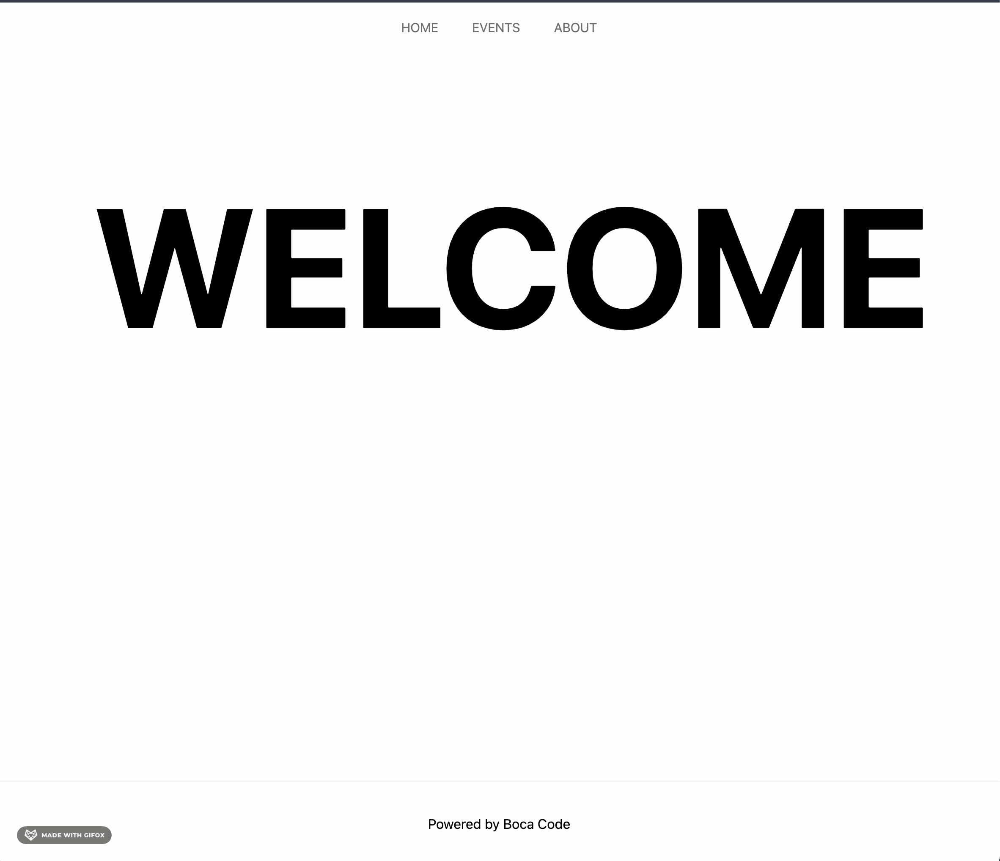

# Simple Next.js Web app for Florida JS Meetup


##### Pre-requirements: [Node.js](https://nodejs.org/en/download/), and React Knowledge

## Getting Started

First, install dependencies by running
```bash
yarn 
#or 
npm i
``` 

Then run project locally with 

```bash
npm run dev
# or
yarn dev
```

Open [http://localhost:3000](http://localhost:3000) with your browser to see the result.
